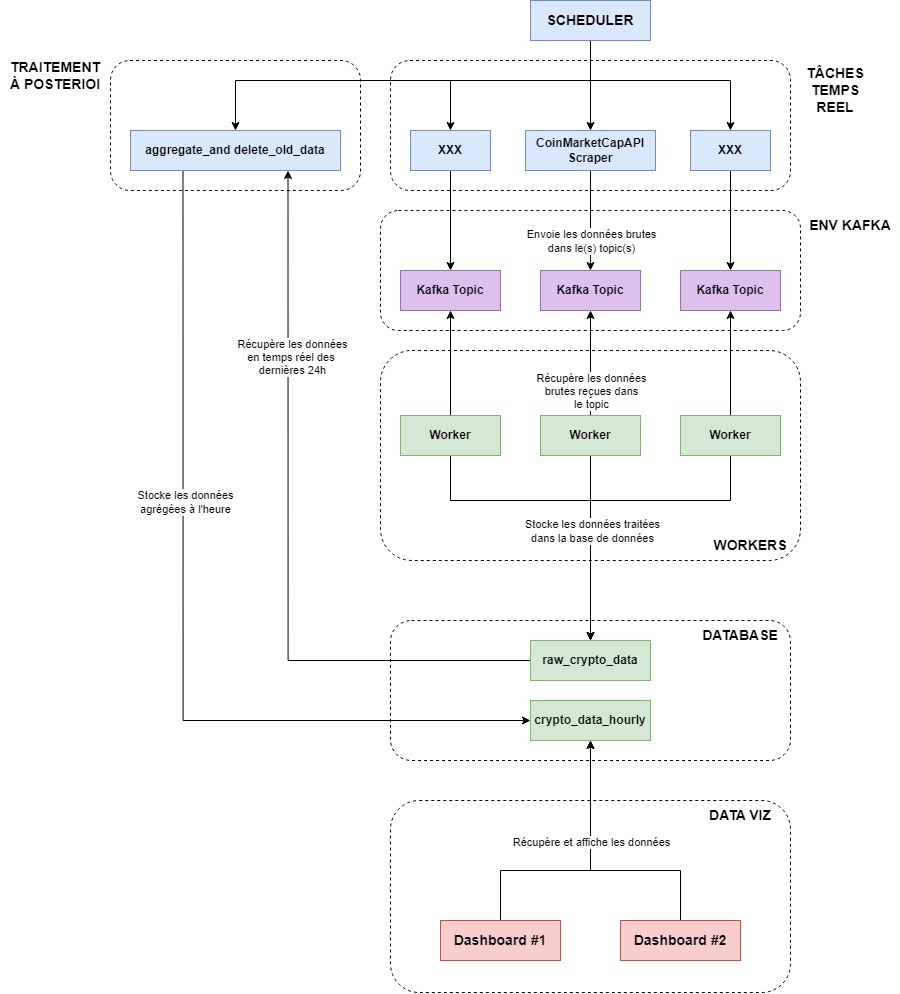

# Crypto Viz

  

## Introduction

Le but du projet est de concevoir une pipeline en temps réel permettant de scraper des données sur les cryptomonnaies et les afficher dans un dashboard interactif.

## Architecture

### Diagramme d'Architecture



### Description de la pipeline

- **Scheduler**
  - **APScheduler** (librarie Python) pour gérer les tâches.
  - Gère les tâches de scraping et de traitement à postériori.
  - **Scraping (Producers)** 
    - Récupérer les données brutes sur les crypto-monnaies depuis une source (scraping brut ou API). 
    - **Scraping** des données quasiement en **temps réel (granularité d'environ 1 minutes)** pour récupérer le plus de données possibles. 
    - Les données sont ensuite envoyées dans le **topic Kafka spécifique à la source.** 
    - La récupération de données est lancée via le **Scheduler** avec une granularité spécifique à chaque source.
  - **Traitement à postériori**
    - Une fois dans la journée à **00:05 UTC** récupère toutes les données stockées dans la journée dans la table `raw_crypto_data` pour les agréger à l'heure.
    - Insère les **données historiques** dans la table `crypto_data_hourly`.
    - Supprime les données de la journée de la table `raw_crypto_data`.


- **Traitement (Consumers)**
  - Récupérer les données brutes depuis le topic **Kafka**.
  - Traiter les données brutes et les mettre au format de la base de données.
  - Stocker les données dans la table `raw_crypto_data`.
  - Un **Worker** par source.
  - Les **Workers écoutent en continue un topic** et traite les données à chaque message reçu.


- **Environnement Kafka**
  - Gère les messages entre **les Scrapers** et **les systèmes de traitement**. 
  - On utilise **un topic par source** de données pour traiter chaque source indépendamment.

    
- **Base de Données**
  - **PostgreSQL/TimescaleDB** est utilisé pour stocker les données.
  - Une table `raw_crypto_data` pour stocker les données de la journée en cours avec une **granularité fine (environ 1 minute).**
  - Une table `crypto_data_hourly` pour stocker les données historiques avec une **granularité d'une heure.**

- **Grafana** : Permet la visualisation des données collectées et traitées.

---

## Structure des Fichiers

```bash
├── config/ # Fichiers de configuration

├── init-scripts/ # Scripts d'initialisation pour la base de données

├── src/

│ ├── database/ # Gestion de la connexion et modèles de la base de données

│ ├── kafka/ # Gestion de la connexion et des interactions avec l'environnement Kafka

│ ├── models/ # Modèles de données

│ ├── tasks/ # Tâches spécifiques (scraping, mise à jour des bases de données)

│ └── workers/ # Tâches indépendantes (workers)

├── .env.example # Répertoire des variables d'environnements du projet

├── .pre-commit-config.yaml # Fichier de configuration pour les linters/formatters Python
 
├── Dockerfile

├── docker-compose.yml

└── requirements.txt # Dépendances Python

```

## Libraries utilisées

- `kafka-python` : Pour gérer les intéractions avec Kafka.
- `SQLAlchemy` : ORM SQL pour python.
- `APScheduler` : Pour gérer l'orchestration des tâches.
- `pre-commit` : Pour le formatage du code.